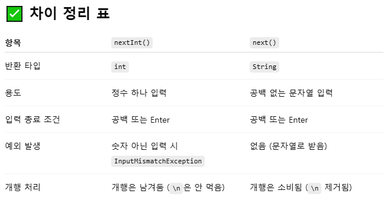

1. sNum.chars()란?
-> 자바에서 Stream.chars()는  아래와 같은 시그니처를 가지며, 이 메서드는 문자열의 각 문자를 **유니코드 값(int)**로 변환한 스트림을 제공합니다

```
public IntStream chars()
```

2. .map(c -> c - '0')에서 숫자가 반환되는 이유?

Stream.chars()를 통해서 유니코드로 값이 변경 된 수 문자 '0'을 뺀다면 순수 숫자 값을 가져오기 때문 

3. 왜 .forEach()가 아니라 .sum()을 사용함?

    forEach() >> 보통 스트림에 대해 출력이나 누적 작업에 사용함

```
예시::
int sum = 0; 
stream.forEach( x -> sum += x );
```

    sum() >> IntStream의 전용 메서드이며, 스트림의 모든 값을 더해서 하나의 int 값으로 변환함 

결론 -> 숫자의 누적이 목적이기에 sum()이 자연스럽고 안전한 방식이다. 

4. nextInt()와 next()의 차이 

Scanner.nextInt() > 입력에서 정수를 하나 읽어서 반환
(이때 공백, 개행이 존재한다면, 그 전까지 읽고 읽은 내용을 int로 해석함)

```
Scanner sc = new Scanner(System.in);
int n = sc.nextInt(); // 입력: 5
```
> 결과는 5가 나옴

 
next() > 단어를 입력 받음 
(이때, 입력에서 공백 전까지의 문자열을 읽어서 반환하며, 단어를 읽는다고 보면 됨.)

```
Scanner sc = new Scanner(System.in);
String s = sc.next(); // 입력: 12345
```

> 결과는 정수가 아닌 문자열인 "12345"가 나옴 

 

